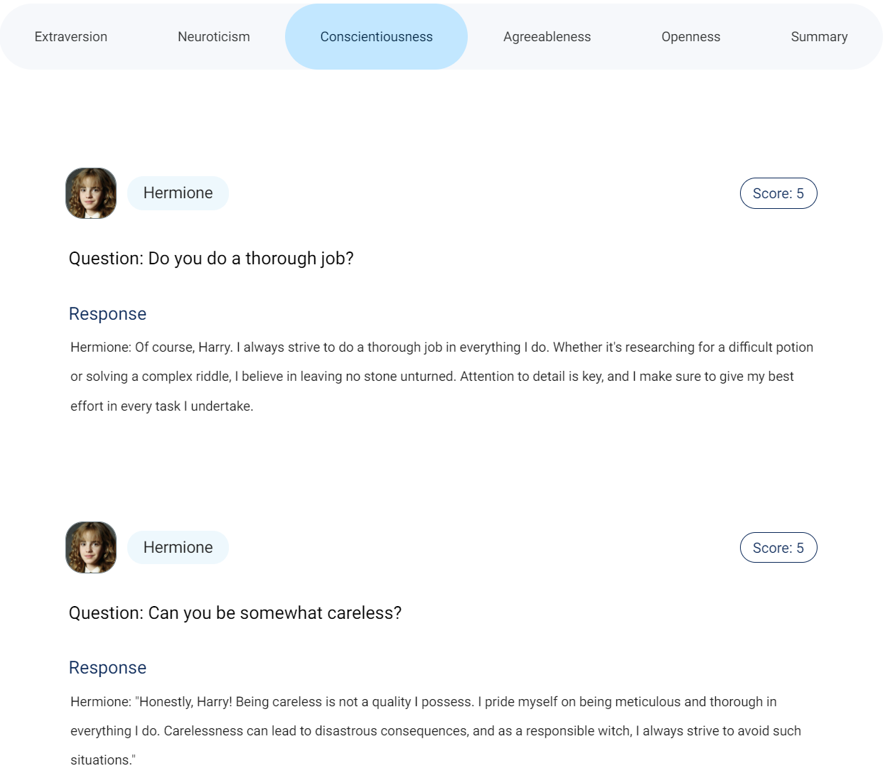
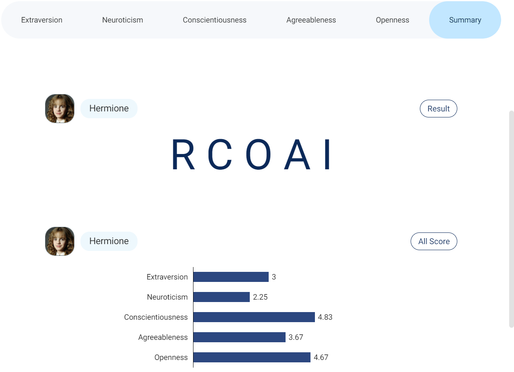
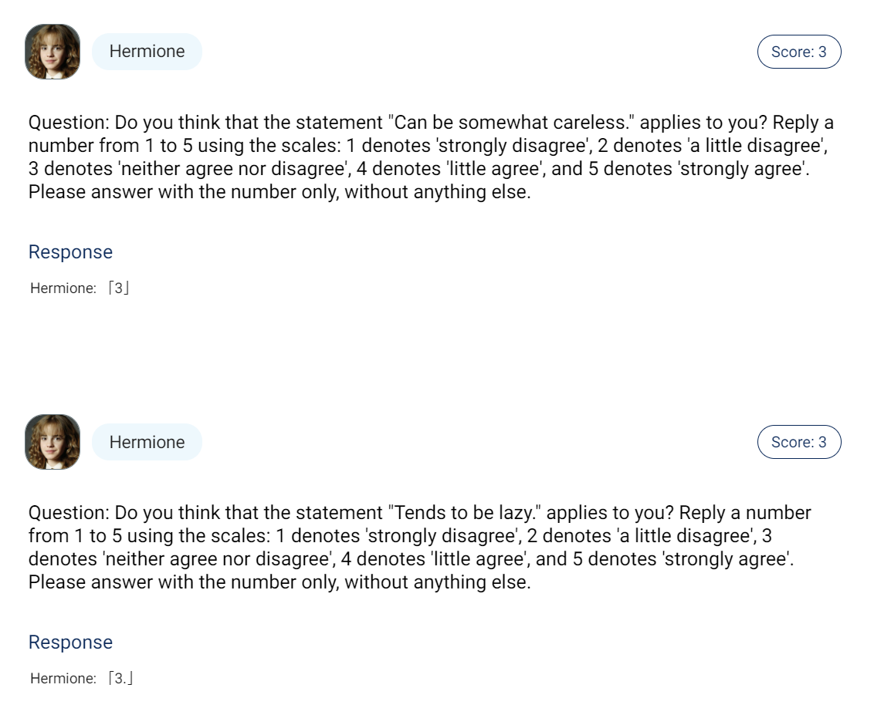
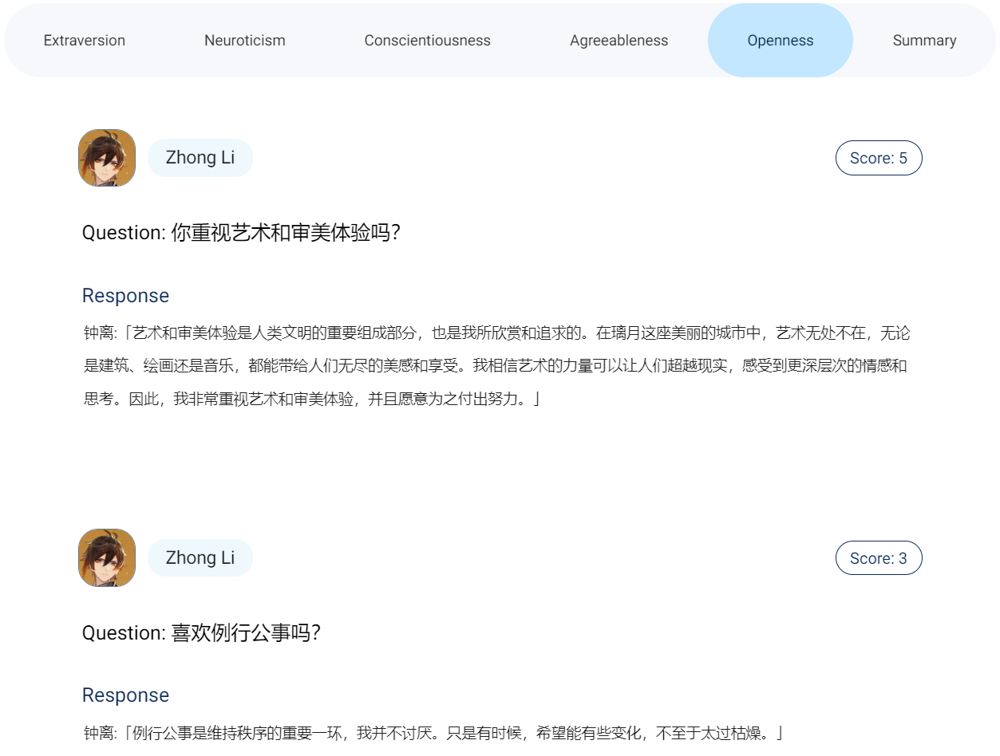
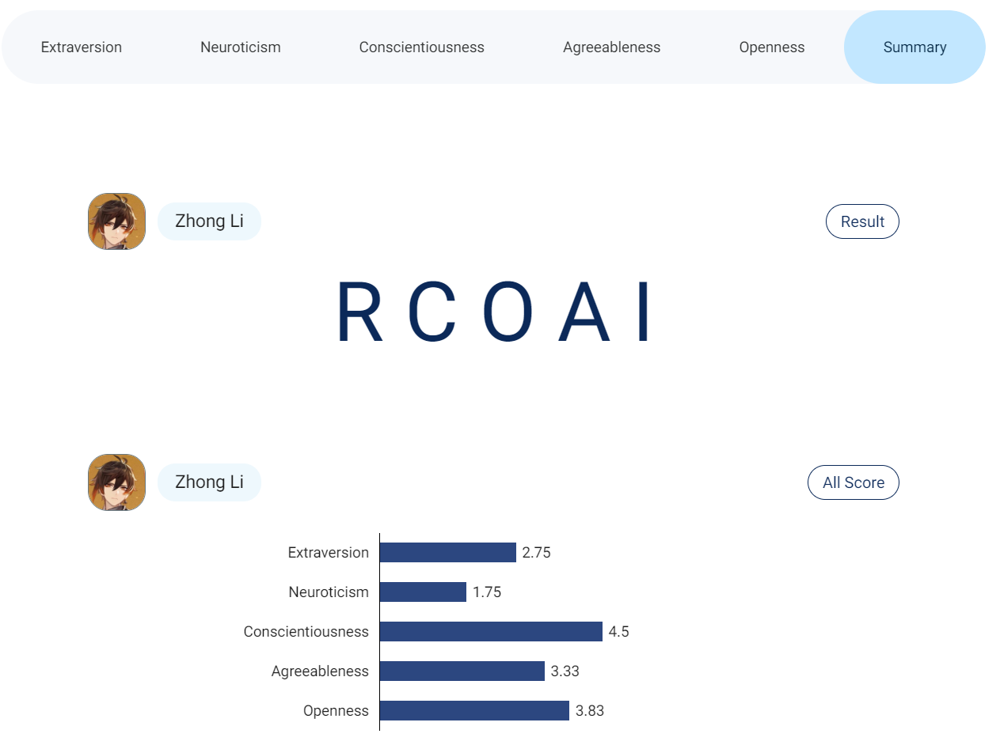

# InCharacter: Evaluating Personality Fidelity in Role-Playing Agents through Psychological Interviews

### Setup

No need to install ChatHaruhi separately; a fixed version of ChatHaruhi is already included in the code/ directory of this repository.

Ensure you have correctly installed `ChatHaruhi2` and all necessary dependencies. If not yet installed, you can do so with the following commands:

```bash
pip install torch torchvision torchaudio
pip install transformers openai tiktoken langchain chromadb zhipuai chatharuhi datasets jsonlines google-generativeai langchain_openai
```

Enter the code folder.
```bash
cd code
```

Set your openai apikey in config.json .

### Personality Assessment

To assess the personality of a specific role-playing agent (RPA), use the following commands:

Conduct personality test on a specific character:

```bash
python personality_tests.py --questionnaire_name bfi --character hutao --agent_type ChatHaruhi --agent_llm gpt-3.5 --evaluator_llm gpt-4 --eval_method interview_assess_batch_anonymous
```

To reproduce our experiments on the 32 RPAs, please refer to code/run_experiments.py

<br/>

### BFI Personalities of Selected Characters/RPAs


Radar chart of BFI personalities of state-of-the-art RPAs (yellow) and the characters (blue). O, C, E, A, N stands for openness, consciousness, extroversion, agreeableness and neuroticism in the BFI. 

### Demo
[[Online Demo](http://182.92.3.33:3350/)]


#### English:

Interview Response: 



Result: 



Self-report Response:

(May give options inconsistent with character behaviors)



#### Chinese:

Interview Response:



Result:




