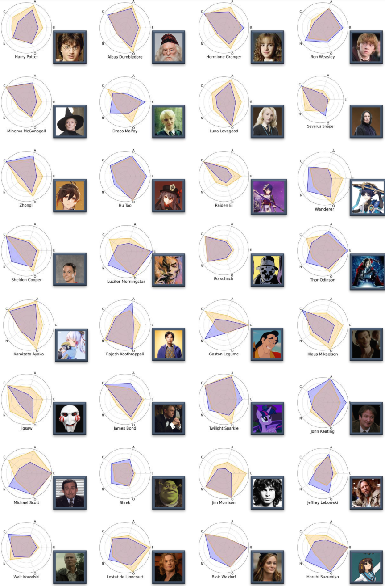

# InCharacter: Evaluating Personality Fidelity in Role-Playing Agents through Psychological Interviews

### News

- *May. 2024*: InCharacter got accepted to **ACL 2024**! See you in Bangkok.

### Setup


Install necessary dependencies via:

```bash
pip install -r requirements.txt
```

No need to install ChatHaruhi separately; a fixed version of ChatHaruhi is already included in the code/ directory of this repository.

Enter the code folder.
```bash
cd code
```

Set your openai apikey in config.json. You can refer to config_template.json for its format.

### Personality Assessment

To assess the personality of a specific role-playing agent (RPA), use the following commands:

Conduct personality test on a specific character:

```bash
python personality_tests.py --questionnaire_name BFI --character hutao --agent_type ChatHaruhi --agent_llm gpt-3.5 --evaluator_llm gpt-4 --eval_method interview_assess_batch_anonymous
```

Supported choices for eval_method include ['self_report' (SR), 'self_report_cot' (SR-CoT), 'expert_rating' (ER_batch), 'expert_rating_collective' (ER_all), 'option_conversion' (OC),'dimension_option_conversion' (d-OC)].

To reproduce our experiments on the 32 RPAs, please refer to code/run_experiments.py

<br/>

### BFI Personalities of Selected Characters/RPAs



Radar chart of BFI personalities of state-of-the-art RPAs (yellow) and the characters (blue). O, C, E, A, N stands for openness, consciousness, extroversion, agreeableness and neuroticism in the BFI. 

### Demo
[[Online Demo](http://182.92.3.33:3350/)]


#### English:

Interview Response: 


Result: 


Self-report Response:

(May give options inconsistent with character behaviors)


#### Chinese:

Interview Response:


Result:


### PDB character extraction

**PDB Character Search Script**

This Python script facilitates automated searching of character profiles on the Personality Database (PDB) website using Selenium and BeautifulSoup. The script is designed to retrieve the ID of a given character by searching the website and extracting relevant profile information.

#### Key Features:
- **Automated Web Interaction:** Utilizes Microsoft Edge's headless browser for automated web interaction via Selenium.
- **Web Scraping:** Scrapes the search results from the Personality Database using BeautifulSoup to parse the HTML content.
- **Character Search:** Retrieves character ID based on user input by querying the search feature on the website.

#### Dependencies:
- `requests`: For making HTTP requests (optional in this context as Selenium is used for web navigation).
- `BeautifulSoup` (`bs4`): For HTML parsing and extracting relevant data from the page.
- `msedge.selenium_tools`: For interacting with the Microsoft Edge browser in headless mode.
- `json`: For handling data in JSON format.

#### How to Use:
1. Install the necessary dependencies using the following command:
   ```bash
   pip install requests beautifulsoup4 msedge-selenium-tools
   ```
2. Ensure you have Microsoft Edge and the corresponding WebDriver (`msedgedriver.exe`) installed.
3. Execute the script and input the desired character name. The script will return the ID of the character if found.

#### Example Usage:
```python
character_id = get_character_id("Tony Stark")
print(character_id)
```

#### Notes:
- The script is set up for use with Microsoft Edge. If you want to use a different browser (like Chrome), update the browser options and WebDriver accordingly.
- The script runs in headless mode, meaning it operates without opening a visible browser window.

